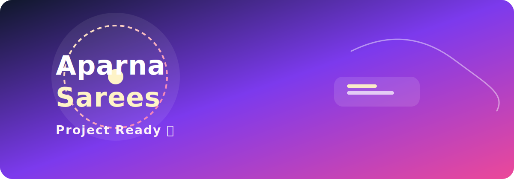

# Aparna Sarees

A modern and elegant saree-themed web project built with Next.js, designed to look polished and ready for presentation.



## ✨ What this project includes

- Responsive landing experience
- Clean and modern UI styling
- Ready structure for future product and shop pages
- Smooth, visually appealing presentation for demo purposes

## 🚀 Run locally

```bash
cd aparna-sarees-client
npm install
npm run dev
```

Then open http://localhost:3000 in your browser.

## 🛠 Tech stack

- Next.js 16
- React 19
- Tailwind CSS 4
- TypeScript

## 📌 Status

The project is set up and ready for further development and showcase.
